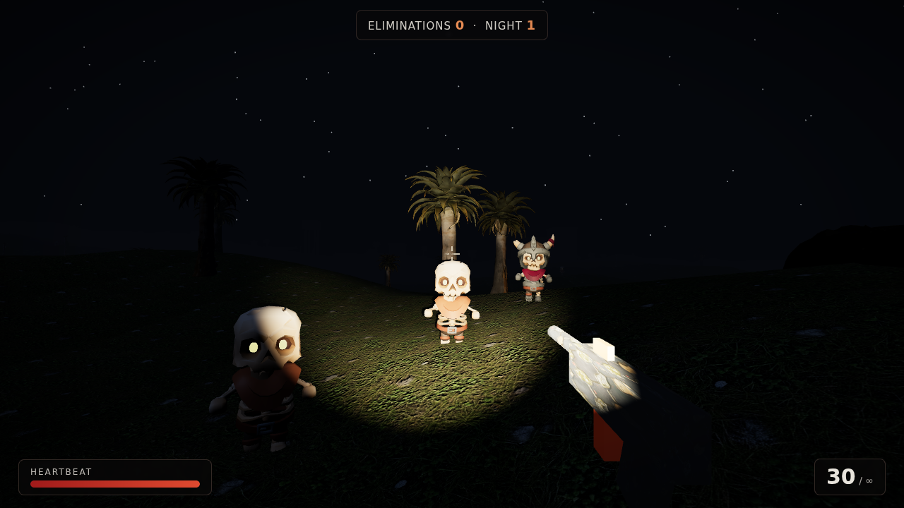
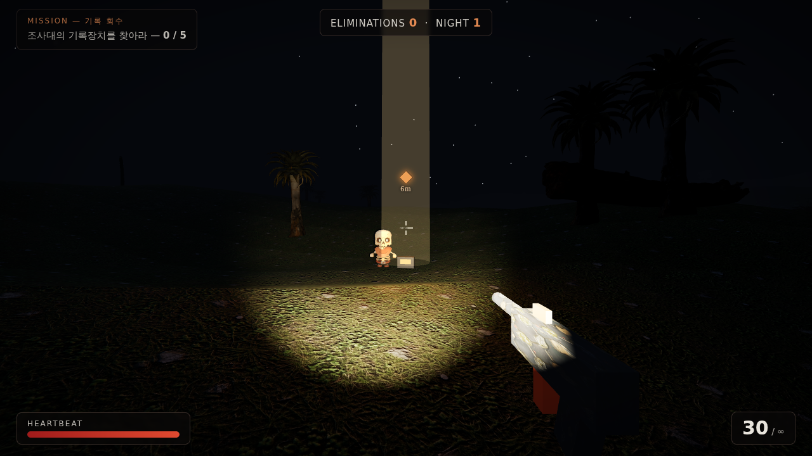
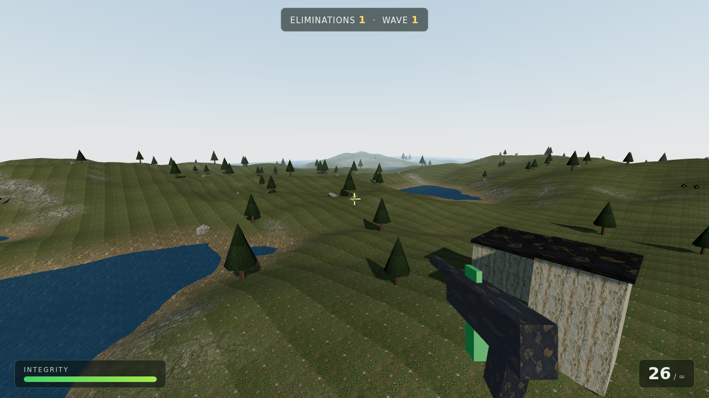
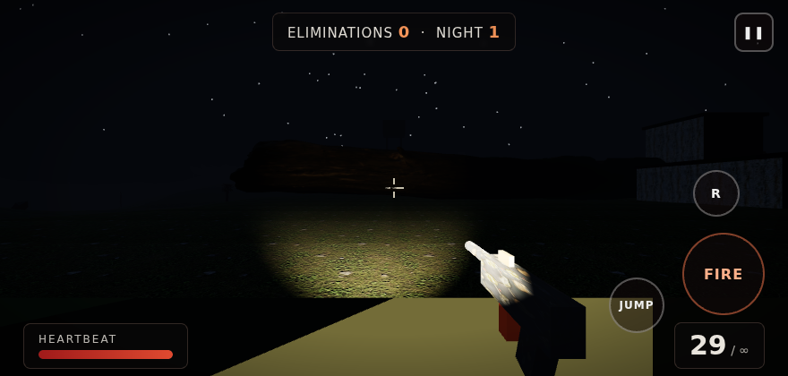

# FABLE FRONTIER: NIGHTFALL — Horror FPS Demo

브라우저에서 바로 실행되는 **오픈 월드 호러 FPS** 데모입니다. Claude(Fable 5)가 Three.js로 제작했습니다.

칠흑 같은 밤, 짙은 안개, 손전등 하나. 스켈레톤들이 어둠 속에서 걸어 나옵니다.

> 무전이 끊긴 지 사흘째. 이 골짜기로 들어간 조사대는 돌아오지 않았다.
> 그들이 남긴 **기록장치 5개**를 회수하고, 감시탑의 **발전기**를 살려 구조 신호를 보내라.
> 새벽까지 버텨라. 밤은 네 편이 아니다.





## 실행 방법

정적 파일 서버만 있으면 됩니다 (ES 모듈 특성상 `file://`로는 열 수 없습니다).

```bash
# 레포 루트에서
python3 -m http.server 8000
# 브라우저에서 http://localhost:8000 접속
```

Cloudflare Pages / GitHub Pages에 올리면 바로 온라인 플레이 가능합니다.

## 조작법

### 데스크톱
| 입력 | 동작 |
|---|---|
| `W` `A` `S` `D` | 이동 |
| `Shift` | 질주 |
| `Space` | 점프 |
| 마우스 | 시점 |
| 좌클릭 | 사격 (자동 연사) |
| `R` | 재장전 |
| `E` | 상호작용 (기록 회수 / 발전기 가동) |
| `Esc` | 일시정지 |

### 모바일 (터치)
| 입력 | 동작 |
|---|---|
| 왼쪽 화면 드래그 | 가상 조이스틱 이동 (끝까지 밀면 질주) |
| 오른쪽 화면 드래그 | 시점 회전 |
| `FIRE` 버튼 | 사격 (홀드 시 연사) |
| `JUMP` / `R` 버튼 | 점프 / 재장전 |
| `회수` 버튼 | 상호작용 (목표 근처에서 자동 표시) |
| `❚❚` 버튼 | 일시정지 |



## 게임 내용

- **3막 스토리 미션** —
  ① 안개 속에 흩어진 조사대의 **기록장치 5개 회수** (회수할 때마다 섬뜩한 기록이 공개됩니다)
  ② 감시탑의 **발전기 가동** (E키 홀드)
  ③ 구조 신호가 송신되는 **90초 동안 몰려오는 무리에게서 생존** → 새벽, 승리
- **목표 마커 시스템** — 다음 목표를 가리키는 화면 마커와 거리 표시, 근접 시 상호작용 프롬프트
- **AI 생성 BGM** — Higgsfield(sonilo_music)로 생성한 95초 다크 앰비언트 루프
- **밤의 오픈 월드** — 600×600m 절차 생성 지형, 달빛과 별, 시야를 조여오는 안개, 그림자를 드리우는 손전등
- **스켈레톤 무리** — 리깅·애니메이션이 살아있는 3D 캐릭터(걷기/공격/사망 모션)가 사방에서 추격해 근접 공격. 처치할수록 밤이 깊어지고 수가 늘어납니다
- **실사 고사목 숲** — 포토그래메트리 기반 죽은 나무 3종을 인스턴싱으로 배치
- **히트스캔 사격** — 트레이서, 총구 섬광(어둠을 밝히는 포인트라이트), 반동, 히트마커
- **공포 사운드** — WebAudio 합성: 저음 드론 앰비언트, 바람, 스켈레톤의 신음, 체력이 낮으면 심장박동
- **체력 재생 / 피격 비네트 / 사망→재출격 루프**

## 에셋 크레딧 (전부 무료/오픈 라이선스)

| 에셋 | 출처 | 라이선스 |
|---|---|---|
| 스켈레톤 캐릭터 2종 (애니메이션 90+종) | [KayKit Character Pack: Skeletons](https://kaylousberg.itch.io/kaykit-skeletons) by Kay Lousberg | CC0 |
| 죽은 나무 포토스캔 3종 | [Poly Haven](https://polyhaven.com/) (dead_tree_trunk, quiver_tree_02, dead_quiver_trunk) | CC0 |
| 지면/건물/금속 PBR 텍스처 7종 | Higgsfield AI 생성 후 심리스 보정 + 노멀맵 추출 | 자체 생성 |
| BGM (다크 앰비언트 95초 루프) | Higgsfield `sonilo_music` AI 생성 | 자체 생성 |
| 렌더링 엔진 | [Three.js](https://threejs.org/) r165 (`lib/`에 번들) | MIT |

나무 모델은 원본이 8만~10만 폴리곤이라 `gltfpack`(meshoptimizer)으로 UV·재질을 보존한 채 3천~9천 폴리곤으로 경량화해 사용합니다.

## 기술 메모

- 빌드 도구 없음 — 순수 ES 모듈, 레포가 곧 배포물
- 지형은 잔디/암벽/모래/눈 4중 스플랫 셰이더(`onBeforeCompile`), 노멀맵도 가중 블렌딩
- 적 캐릭터는 `SkeletonUtils.clone` + `AnimationMixer`로 개체별 상태(추격/공격/사망) 전환
- 터치 기기는 자동 감지되어 모바일 HUD로 전환

## 파일 구조

```
index.html          게임 페이지 + HUD + 터치 컨트롤
src/main.js         게임 전체 (지형, AI, 사격, 파티클, 오디오)
assets/textures/    Higgsfield AI 생성 PBR 텍스처
assets/models/      CC0 3D 모델 (스켈레톤, 고사목)
lib/                Three.js + 로더 번들
docs/               스크린샷
```
